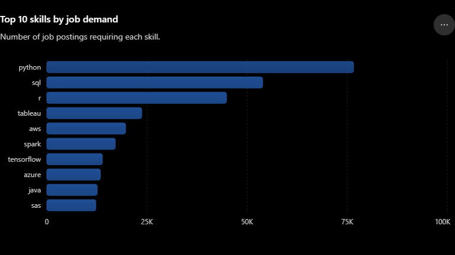
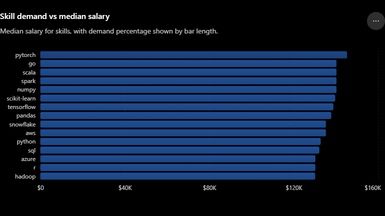
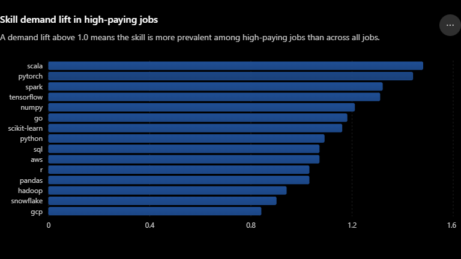

# 🔍 SQL EDA: Data Scientist Job Market Analysis (US)

A SQL project exploring what skills matter most for Data Scientist jobs in the United States.

---

## 🧾 Summary

- 3 SQL queries, each building on the last
- Uses joins, CTEs, and percentile calculations to go beyond basic counting
- Goal: find out which skills are in demand, which pay well, and which are most tied to top-paying jobs

**Files:**
1. [`01_top_demanded_skills.sql`](./sql/01_top_demanded_skills.sql) – most requested skills
2. [`02_skill_demand_vs_compensation.sql`](./sql/02_skill_demand_vs_compensation.sql) – demand vs. salary
3. [`03_high_paying_skill.sql`](./sql/03_high_paying_skill.sql) – skills tied to the highest-paying jobs

```text
1_EDA/
├── images/
│   ├── demand_vs_compensation.png
│   ├── high_paying_skill_lift.png 
│   └── top_demanded_skills.png
│   sql/
│   ├── 01_top_demanded_skills.sql
│   ├── 02_skill_demand_vs_compensation.sql
│   └── 03_high_paying_skill.sql
└── README.md
```

---

## 🧩 The Questions

1. **What skills are most requested** for Data Scientist roles in the US?
2. **Do popular skills also pay well** — or is there a trade-off?
3. **Which skills are most tied to high-paying jobs specifically** — not just common everywhere, but a signal of premium pay?

**Data model:** star schema with one fact table (`job_postings_fact`) and two supporting tables (`skills_dim`, `skills_job_dim`) linking jobs to skills. 


Data warehouse sourced from Luke Barousse's [SQL Data Engineering Course](https://github.com/lukebarousse/SQL_Data_Engineering_Course).

---

## 🧰 Tech Stack

- **Query Engine:** DuckDB
- **Language:** SQL
- **Tools:** VS Code + DuckDB CLI, Git/GitHub

---

## 🏗 How Each Query Works

**Query 1 – Top Demanded Skills**
Joins jobs to skills and counts postings per skill. Simple and direct.



**Query 2 – Demand vs. Compensation**
Filters to salaried US jobs, then finds each skill's median salary and how many jobs mention it. Only keeps skills with 500+ postings, so rare skills don't skew results.



**Query 3 – High-Paying Skill Concentration**
Finds the salary cutoff for the top 25% of jobs, then checks: is each skill more common in that top group than it is overall? That ratio is called **demand lift**:

```
demand_lift = (skill's share of high-paying jobs) ÷ (skill's share of all jobs)
```

- Lift = 1.0 → no special link to high pay
- Lift > 1.0 → this skill shows up in high-paying jobs more than expected



---

## 💡 Key Insights

- **Python, SQL, and R are the core skills** — the most requested by far, and still common even in top-paying jobs.
- **Tableau leads visualization tools.**
- **Cloud and AI skills are on the rise.**
- **Popularity ≠ pay.** PyTorch has the highest median salary but isn't the most in-demand skill — Python and R are requested more often. Rarer, more technical skills tend to pay more.
- **Scala has the highest demand lift (1.48)** — it's not the most common skill, but it shows up in high-paying jobs far more than its overall popularity would suggest. That makes it a strong skill to learn specifically for pay, not just employability.
- **AI/ML skills (PyTorch, Spark, TensorFlow) also show high lift** — they're disproportionately common in top-paying roles.
- **Fundamentals stay essential.** Python, SQL, and R have lift near 1.0 in high-paying jobs — not because they don't matter, but because they're required everywhere, at every pay level.

---

## 💻 SQL Concepts Used

- CTEs to break complex logic into readable steps
- Multi-table joins (fact + dimension + bridge tables)
- Conditional counting (`COUNT(DISTINCT CASE WHEN ...)`)
- Percentile calculation (`QUANTILE_CONT`) for a data-driven salary cutoff
- A custom "lift" metric comparing a skill's rate in one group vs. overall
- Filtering with `HAVING`/`WHERE` to avoid noise from rare skills

---

## 📌 Notes

- Salary analysis only covers jobs that disclosed a salary — a smaller, possibly biased subset.
- The 500/50 posting thresholds were chosen to keep results reliable, not arbitrary.
